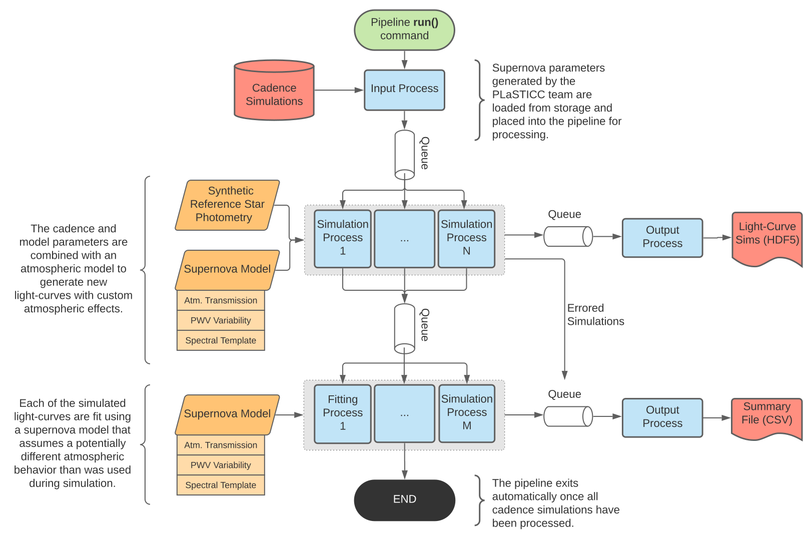
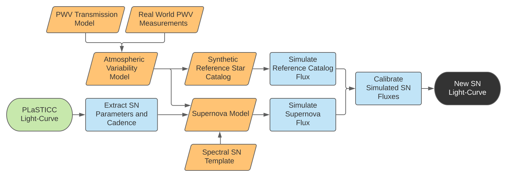

Impact of Chromatic Effects on LSST SNe Ia
==========================================

The **Supernova Atmospheric Simulation** package (``snat_sim``) was developed
within the Dark Energy Science Collaboration (DESC) to support research into
the impact of atmospheric calibration techniques on astronomical observations
of Type Ia Supernovae (`SNe Ia <https://en.wikipedia.org/wiki/Type_Ia_supernova>`_).
This documentation is provided as a technical reference for the package as
well as minimal outline of the research it was designed to support. For
questions concerning the ``snat_sim`` package, please see the API section of
these docs or raise an issue on `GitHub <https://github.com/lsstdesc/sn-pwv>`_.

.. note:: The ``snat_sim`` package is designed to support scientific
   research efforts. This documentation may at times assume the reader has
   a basic understanding of astronomy and how astronomical surveys work. However,
   these assumptions are kept to a minimum wherever possible.

Pipeline Overview
-----------------

Each module of the ``snat_sim`` package is designed to represent a distinct
stage of the analysis process. Ultimately, this functionality is brought together
in the form of a single, modular analysis pipeline -
the ``pipeline.FittingPipeline`` class.

An example of a running pipeline instance is shown below. Each process (colored
in blue) is executed in parallel, and the number of processes launched in each
pool (grey boxes) can be increased as necessary to meet performance requirements.
Data sources read from or written to disk are shown in red. Objects cached
in memory are shaded orange.

Light-Curve Simulation
----------------------

The light-curve simulation process works by combining the results of several
independent models. The intrinsic behavior of Type Ia Supernovae, the
propagation of light through our atmosphere, and how the atmospheric makeup
changes over time are all considered in the simulation.

Contribution and Usage
----------------------

This project is open source and contributors are welcome.
All involvement with this project, including source code contributions,
is subject to the policies of the Dark Energy Science
Collaboration, with particular emphasis on the **Code of Conduct** and
**Software Development Policy**. More information is available
`here <https://lsstdesc.org/pages/policies.html>`_.

.. toctree::
   :hidden:
   :maxdepth: 0
   :titlesonly:

   Introduction<self>
   overview/install.rst
   overview/command_line.rst
   overview/data_model.rst
   overview/data_provenance.rst
   overview/integrations.rst

.. toctree::
   :hidden:
   :maxdepth: 1
   :caption: Notebooks / Science Examples

   notebooks/notebook_summaries.rst
   notebooks/lsst_filters.nblink
   notebooks/pwv_eff_on_black_body.nblink
   notebooks/sne_delta_mag.nblink
   notebooks/pwv_modeling.nblink
   notebooks/simulating_lc_for_cadence.nblink
   notebooks/pipeline_outputs.nblink

.. toctree::
   :hidden:
   :maxdepth: 1
   :caption: API Reference
   :titlesonly:

   api/models.rst
   api/pipeline/pipeline.rst
   api/utils/utils.rst
   api/data_paths.rst
   api/constants.rst
   api/plasticc.rst
   api/plotting.rst
   api/sn_magnitudes.rst
