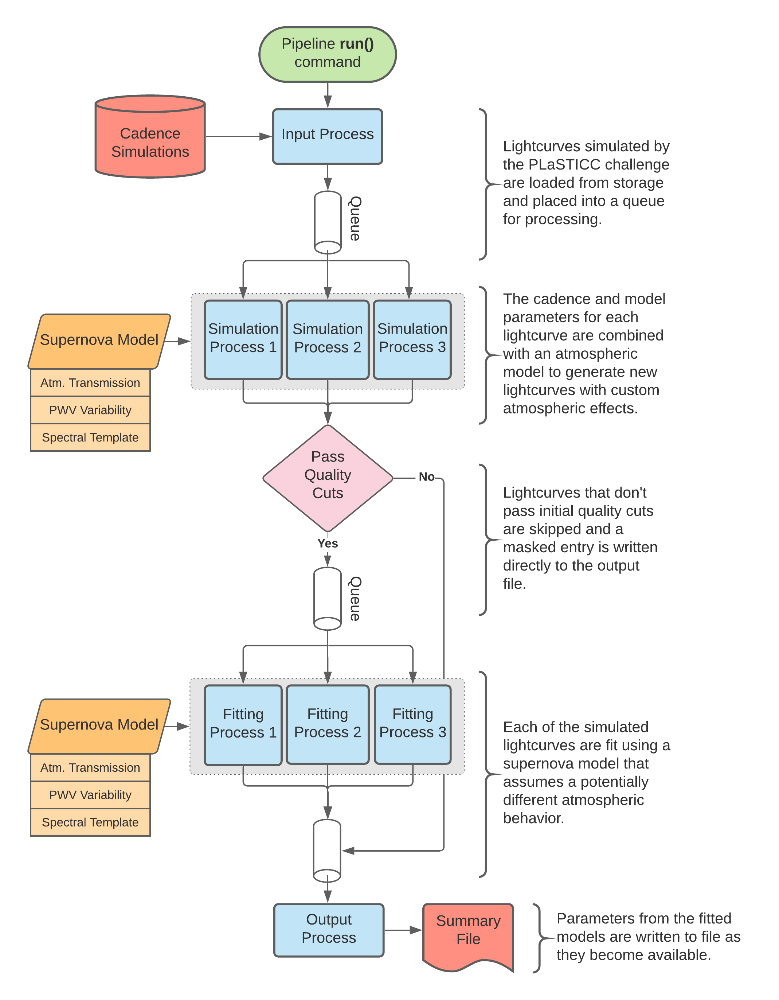

Impact of Chromatic Effects on LSST SNe Ia
==========================================

The **Supernova Atmospheric Simulation** package (``snat_sim``) was developed
within the Dark Energy Science Collaboration (DESC) to support research into
the impact of atmospheric calibration techniques on astronomical observations
of Type Ia Supernovae (`SNe Ia <https://en.wikipedia.org/wiki/Type_Ia_supernova>`_).
This documentation is provided as a technical reference for the package as
well as minimal outline of the research it was designed to support. For
questions concerning the ``snat_sim`` package, please see the API section of
these docs or raise an issue on `GitHub <https://github.com/lsstdesc/sn-pwv>`_.

Pipeline Overview
-----------------

The ``snat_sim`` package is designed first and foremost to support scientific
research efforts. The documentation may at times assume the reader has
a basic understanding of astronomy and how astronomical surveys work. However,
these assumptions are kept to a minimum wherever possible.

``snat_sim`` is designed such that each module represents a distinct stage in
the research process. These steps range in complexity from visualizing simulation
results to simulating the brightness of astronomical objects as a function of time.
Ultimately each of these tasks are combined to support a parallelized analysis
pipeline that handles the bulk of simulation process (outlined below).
Outputs from this pipeline are then reviewed by researches to draw scientific
conclusions.

An example of an running simulation pipeline is shown below. Each process (colored
in blue) is executed in parallel, and the number of processes launched in each
pool (grey boxes) can be increased as necessary to meet performance requirements.
Data sources stored / written on to disk are shown in red, while objects cached
in memory are shaded orange.

Contribution and Usage
----------------------

This project is open source and contributors are welcome.
All involvement with this project, including source code contributions,
is subject to the policies of the Dark Energy Science
Collaboration, with particular emphasis on the **Code of Conduct** and
**Software Development Policy**. More information is available
`here <https://lsstdesc.org/pages/policies.html>`_.

.. toctree::
   :hidden:
   :maxdepth: 0
   :titlesonly:

   Introduction<self>
   overview/install.rst
   overview/data_provenance.rst

.. toctree::
   :hidden:
   :maxdepth: 1
   :caption: Notebooks / Usage Examples

   notebooks/overview.rst
   notebooks/lsst_filters.nblink
   notebooks/pwv_eff_on_black_body.nblink
   notebooks/sne_delta_mag.nblink
   notebooks/pwv_modeling.nblink
   notebooks/simulating_lc_for_cadence.nblink

.. toctree::
   :hidden:
   :maxdepth: 1
   :caption: API Reference
   :titlesonly:

   api/constants.rst
   api/filters.rst
   api/fitting_pipeline.rst
   api/lc_simulation.rst
   api/models.rst
   api/plasticc.rst
   api/plotting.rst
   api/reference_stars.rst
   api/sn_magnitudes.rst
   api/time_series_utils.rst
